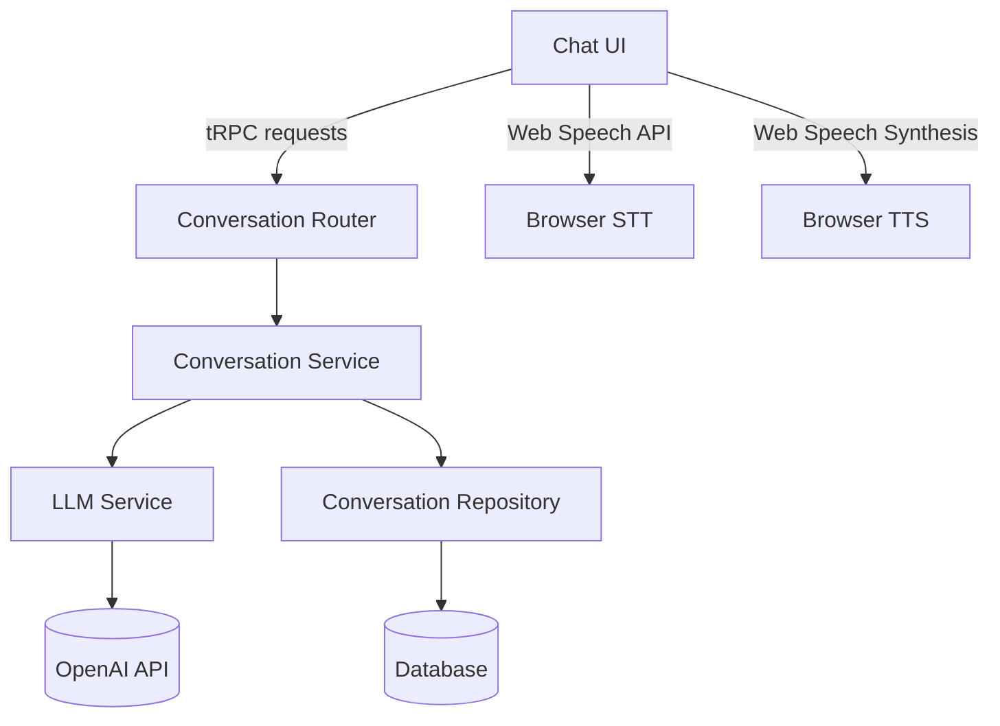
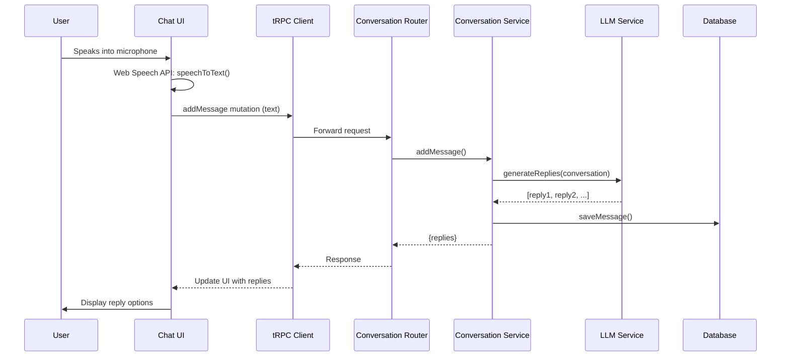
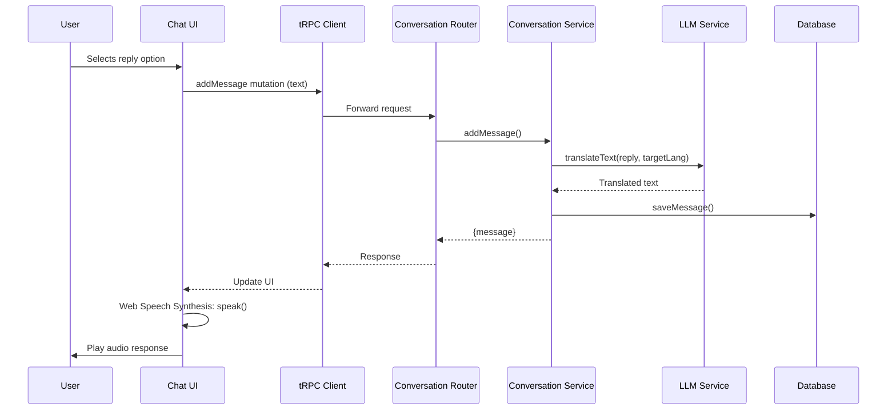

# Travel Tongue Chat API Specification

## 1. Overview

This document defines the API specifications required to implement the live conversation features for Travel Tongue's chat functionality. The architecture follows our existing patterns for tRPC, Drizzle ORM, and NextAuth integration.



The system implements a layered architecture with clear separation between:

- UI Layer (React components)
- API Layer (tRPC routers)
- Service Layer (business logic)
- Repository Layer (data access)
- External Services (LLM, Speech processing)

## 2. tRPC Router Definitions

The conversation API will be implemented as a dedicated router in `src/server/api/routers/conversation.ts`:

```typescript
import { protectedProcedure, publicProcedure, router } from '../trpc'
import { z } from 'zod'
import {
  createConversationInput,
  createMessageInput,
  generateRepliesInput,
  processSpeechInput,
  getConversationHistoryInput,
  conversationOutput,
} from '../schemas/conversation'

export const conversationRouter = router({
  /**
   * Creates a new conversation session
   * @access Protected - requires authentication
   */
  createConversation: protectedProcedure
    .input(createConversationInput)
    .output(conversationOutput)
    .mutation(async ({ ctx, input }) => {
      return ctx.conversationService.createConversation(
        ctx.session.user.id,
        input,
      )
    }),

  /**
   * Adds a new message to an existing conversation
   * @access Protected - requires authentication
   */
  addMessage: protectedProcedure
    .input(createMessageInput)
    .output(conversationOutput)
    .mutation(async ({ ctx, input }) => {
      return ctx.conversationService.addMessage(ctx.session.user.id, input)
    }),

  /**
   * Generates 6 suggested replies based on conversation context
   * @access Protected - requires authentication
   */
  generateReplies: protectedProcedure
    .input(generateRepliesInput)
    .output(z.array(z.string()))
    .query(async ({ ctx, input }) => {
      return ctx.conversationService.generateReplies(ctx.session.user.id, input)
    }),
      z.object({
        audioUrl: z.string(),
        duration: z.number(),
      }),
    )
    .query(async ({ ctx, input }) => {
      return ctx.conversationService.textToSpeech(ctx.session.user.id, input)
    }),

  /**
   * Retrieves conversation history
   * @access Protected - requires authentication
   */
  getHistory: protectedProcedure
    .input(getConversationHistoryInput)
    .output(z.array(conversationOutput))
    .query(async ({ ctx, input }) => {
      return ctx.conversationService.getConversationHistory(
        ctx.session.user.id,
        input,
      )
    }),

  /**
   * Ends a conversation session
   * @access Protected - requires authentication
   */
  endConversation: protectedProcedure
    .input(
      z.object({
        conversationId: z.string().uuid(),
      }),
    )
    .output(
      z.object({
        success: z.boolean(),
        endedAt: z.date(),
      }),
    )
    .mutation(async ({ ctx, input }) => {
      return ctx.conversationService.endConversation(
        ctx.session.user.id,
        input.conversationId,
      )
    }),
})
```

## 3. Service Layer Specifications

### Conversation Service Interface

```typescript
// src/server/api/services/conversationService/interface.ts
import { z } from 'zod'

export interface ConversationService {
  createConversation(
    userId: string,
    input: {
      targetLanguage: string
      scenarioId?: string
      context?: string
    },
  ): Promise<Conversation>

  addMessage(
    userId: string,
    input: {
      conversationId: string
      text: string
      isUserMessage: boolean
      audioUrl?: string
      language?: string
    },
  ): Promise<Conversation>

  generateReplies(
    userId: string,
    input: {
      conversationId: string
      maxReplies?: number // Always 6 for our use case
    },
  ): Promise<string[]>

  getConversationHistory(
    userId: string,
    input: {
      limit?: number
      cursor?: string
    },
  ): Promise<Conversation[]>

  endConversation(
    userId: string,
    conversationId: string,
  ): Promise<{
    success: boolean
    endedAt: Date
  }>
}
```

### LLM Service Interface

```typescript
// src/server/api/services/llmService/interface.ts
import { z } from 'zod'

export interface LLMService {
  /**
   * Generates multiple reply options based on conversation context
   */
  generateReplyOptions(
    conversationId: string,
    targetLanguage: string,
    context?: string,
    maxReplies?: number,
  ): Promise<string[]>

  /**
   * Translates text to target language with context awareness
   */
  translateText(
    text: string,
    targetLanguage: string,
    context?: string,
  ): Promise<string>

  /**
   * Analyzes conversation for learning insights
   */
  analyzeConversation(conversationId: string): Promise<ConversationAnalysis>
}

interface ConversationAnalysis {
  vocabularyScore: number
  grammarAccuracy: number
  pronunciationTips: string[]
  suggestedImprovements: string[]
  culturalNotes: string[]
}
```

## 4. Database Schema Requirements

The conversation schema will be implemented in `src/server/db/schema/conversations.ts`:

```typescript
// src/server/db/schema/conversations.ts
import {
  pgTable,
  uuid,
  text,
  timestamp,
  varchar,
  jsonb,
} from 'drizzle-orm/pg-core'
import { createSelectSchema } from 'drizzle-zod'
import { z } from 'zod'

export const conversations = pgTable('tt_conversations', {
  id: uuid('id').defaultRandom().primaryKey(),
  userId: uuid('user_id').notNull(),
  targetLanguage: varchar('target_language', { length: 10 }).notNull(),
  scenarioId: uuid('scenario_id'),
  context: text('context'),
  createdAt: timestamp('created_at', { withTimezone: true })
    .defaultNow()
    .notNull(),
  endedAt: timestamp('ended_at', { withTimezone: true }),
  totalDuration: varchar('total_duration', { length: 20 }),
  languageProficiency: varchar('language_proficiency', { length: 20 }),
  metrics: jsonb('metrics').$type<ConversationMetrics>().default({}),
  notes: text('notes'),
})

export const messages = pgTable('tt_messages', {
  id: uuid('id').defaultRandom().primaryKey(),
  conversationId: uuid('conversation_id')
    .references(() => conversations.id, {
      onDelete: 'cascade',
    })
    .notNull(),
  userId: uuid('user_id').notNull(),
  text: text('text').notNull(),
  translatedText: text('translated_text'),
  isUserMessage: boolean('is_user_message').notNull(),
  language: varchar('language', { length: 10 }),
  audioUrl: text('audio_url'),
  audioMetrics: jsonb('audio_metrics').$type<AudioMetrics>(),
  createdAt: timestamp('created_at', { withTimezone: true })
    .defaultNow()
    .notNull(),
  llmResponseId: uuid('llm_response_id'),
})

export interface ConversationMetrics {
  totalMessages: number
  avgResponseTime: number
  languageAccuracy: number
  vocabularyDiversity: number
  speechQuality: {
    avgClarity: number
    avgPronunciation: number
  }
}

export interface AudioMetrics {
  duration: number
  qualityScore: number
  processingTime: number
  confidence?: number
}

// Zod schemas for validation
export const selectConversationSchema = createSelectSchema(conversations)
export const selectMessageSchema = createSelectSchema(messages)
```

## 5. Type Definitions

### Request/Response Interfaces with Zod Schemas

```typescript
// src/server/api/schemas/conversation.ts
import { z } from 'zod'

// Conversation creation
export const createConversationInput = z.object({
  targetLanguage: z.string().min(2).max(10),
  scenarioId: z.string().uuid().optional(),
  context: z.string().optional(),
})

// Add message
export const createMessageInput = z.object({
  conversationId: z.string().uuid(),
  text: z.string().min(1),
  isUserMessage: z.boolean(),
  language: z.string().optional(),
})

// Generate replies
export const generateRepliesInput = z.object({
  conversationId: z.string().uuid(),
  maxReplies: z.number().min(1).max(6).default(6),
})

// Get conversation history
export const getConversationHistoryInput = z.object({
  limit: z.number().min(1).max(50).default(20),
  cursor: z.string().uuid().optional(),
})

// Conversation output
export const conversationOutput = z.object({
  id: z.string().uuid(),
  userId: z.string().uuid(),
  targetLanguage: z.string(),
  scenarioId: z.string().uuid().nullable(),
  context: z.string().nullable(),
  createdAt: z.date(),
  endedAt: z.date().nullable(),
  totalDuration: z.string().nullable(),
  languageProficiency: z.string().nullable(),
  metrics: z.record(z.unknown()),
  notes: z.string().nullable(),
  messages: z.array(
    z.object({
      id: z.string().uuid(),
      text: z.string(),
      translatedText: z.string().nullable(),
      isUserMessage: z.boolean(),
      language: z.string().nullable(),
      createdAt: z.date(),
    }),
  ),
})
```

## 6. Error Handling Specifications

### Custom Error Types

```typescript
// src/server/api/errors/conversationErrors.ts
import { TRPCError } from '@trpc/server'

export enum ConversationErrorCode {
  CONVERSATION_NOT_FOUND = 'CONVERSATION_NOT_FOUND',
  TRANSLATION_FAILED = 'TRANSLATION_FAILED',
  LLM_SERVICE_ERROR = 'LLM_SERVICE_ERROR',
  MAX_CONCURRENT_SESSIONS = 'MAX_CONCURRENT_SESSIONS',
  RATE_LIMIT_EXCEEDED = 'RATE_LIMIT_EXCEEDED',
}

export class ConversationError extends TRPCError {
  constructor(code: ConversationErrorCode, message: string, cause?: unknown) {
    super({
      code: 'BAD_REQUEST',
      message,
      cause,
    })
    this.name = 'ConversationError'
    // Map to appropriate TRPCError code
    switch (code) {
      case ConversationErrorCode.CONVERSATION_NOT_FOUND:
        this.code = 'NOT_FOUND'
        break
      case ConversationErrorCode.AUDIO_PROCESSING_FAILED:
      case ConversationErrorCode.TRANSLATION_FAILED:
      case ConversationErrorCode.LLM_SERVICE_ERROR:
        this.code = 'INTERNAL_SERVER_ERROR'
        break
      case ConversationErrorCode.INVALID_AUDIO_QUALITY:
        this.code = 'BAD_REQUEST'
        break
      case ConversationErrorCode.MAX_CONCURRENT_SESSIONS:
        this.code = 'TOO_MANY_REQUESTS'
        break
      case ConversationErrorCode.RATE_LIMIT_EXCEEDED:
        this.code = 'TOO_MANY_REQUESTS'
        break
    }
  }
}

// Error handling middleware
export const conversationErrorMiddleware = trpc.middleware(
  async ({ path, type, next }) => {
    try {
      return await next()
    } catch (err) {
      if (err instanceof ConversationError) {
        throw err
      }

      // Handle other errors
      if (err instanceof TRPCError) {
        throw err
      }

      // Log unexpected errors
      console.error(`Unexpected error in ${path} [${type}]`, err)
      throw new TRPCError({
        code: 'INTERNAL_SERVER_ERROR',
        message: 'An unexpected error occurred',
      })
    }
  },
)
```

### Error Code Reference

| Code                    | HTTP Status | Description                                       | Recovery                                           |
| ----------------------- | ----------- | ------------------------------------------------- | -------------------------------------------------- |
| CONVERSATION_NOT_FOUND  | 404         | The specified conversation ID doesn't exist       | Verify conversation ID or start new conversation   |
| TRANSLATION_FAILED      | 500         | Text translation failed                           | Retry request or check input text                  |
| LLM_SERVICE_ERROR       | 500         | LLM service returned error                        | Retry after brief delay or check service status    |
| MAX_CONCURRENT_SESSIONS | 429         | User has reached maximum concurrent conversations | End existing conversations before starting new one |
| RATE_LIMIT_EXCEEDED     | 429         | Request rate exceeds allowed limit                | Wait before sending additional requests            |

## 7. Performance Requirements

### Targets

| Metric             | Target  | Measurement                        |
| ------------------ | ------- | ---------------------------------- |
| LLM Response       | < 2.0s  | From query to reply generation     |
| Database Queries   | < 100ms | For conversation history retrieval |
| End-to-End Latency | < 3.0s  | Full round-trip for user message   |

### Rate Limiting

| Endpoint        | Limit | Window | Action       |
| --------------- | ----- | ------ | ------------ |
| generateReplies | 15    | 60s    | 429 response |
| addMessage      | 5     | 10s    | 429 response |
| getHistory      | 30    | 60s    | 429 response |

Rate limits will be implemented using Redis-based token bucket algorithm with the following configuration:

```typescript
// src/server/api/middleware/rateLimit.ts
import { Ratelimit } from '@upstash/ratelimit'
import { Redis } from '@upstash/redis'

const redis = Redis.fromEnv()
const rateLimitConfig = {
  processSpeech: { tokens: 10, refillRate: 10, interval: '60s' },
  textToSpeech: { tokens: 20, refillRate: 20, interval: '60s' },
  generateReplies: { tokens: 15, refillRate: 15, interval: '60s' },
  addMessage: { tokens: 5, refillRate: 5, interval: '10s' },
  getHistory: { tokens: 30, refillRate: 30, interval: '60s' },
}

export const rateLimitMiddleware = (endpoint: keyof typeof rateLimitConfig) => {
  const config = rateLimitConfig[endpoint]
  const ratelimit = new Ratelimit({
    redis,
    limiter: Ratelimit.tokenBucket(
      config.tokens,
      config.refillRate,
      config.interval,
    ),
    analytics: true,
  })

  return trpc.middleware(async ({ ctx, next }) => {
    const userId = ctx.session?.user?.id
    if (!userId) {
      return next()
    }

    const { success } = await ratelimit.limit(userId)
    if (!success) {
      throw new TRPCError({
        code: 'TOO_MANY_REQUESTS',
        message: 'Rate limit exceeded',
      })
    }

    return next()
  })
}
```

## 8. Data Flow Diagrams

### Conversation Processing Flow



### Message Flow with TTS



## 9. Integration Points

### With Existing Architecture

1. **Authentication Integration**
   - Uses existing NextAuth session management
   - All endpoints require protectedProcedure
   - User ID from `ctx.session.user.id` is used for data isolation

2. **LLM Service Integration**
   - Reuses existing LLM service architecture
   - Extends current `llmService` with conversation-specific functionality
   - Uses same OpenAI configuration and retry logic

3. **Database Integration**
   - Follows Drizzle ORM patterns established in existing schema files
   - Uses same `tt_` table prefix convention
   - Integrates with existing user authentication tables

4. **Frontend Integration**
   - Compatible with existing tRPC React hooks
   - Follows same error handling patterns as other routers
   - Works with existing loading states and UI patterns

5. **Error Monitoring**
   - Integrates with existing error tracking system
   - Uses same error categorization approach
   - Provides detailed metrics for debugging

### Setup Instructions

1. Register the conversation router in `src/server/api/root.ts`:

```typescript
import { conversationRouter } from './routers/conversation'

export const appRouter = router({
  // ... existing routers
  conversation: conversationRouter,
})
```

2. Implement the service layer in `src/server/api/services/conversationService/` following the interface specifications

3. Create the database schema in `src/server/db/schema/conversations.ts`

4. Add required environment variables:

```
# No speech service environment variables needed
```

5. Configure rate limiting in `src/server/api/middleware/rateLimit.ts` (remove speech-related rate limits)
