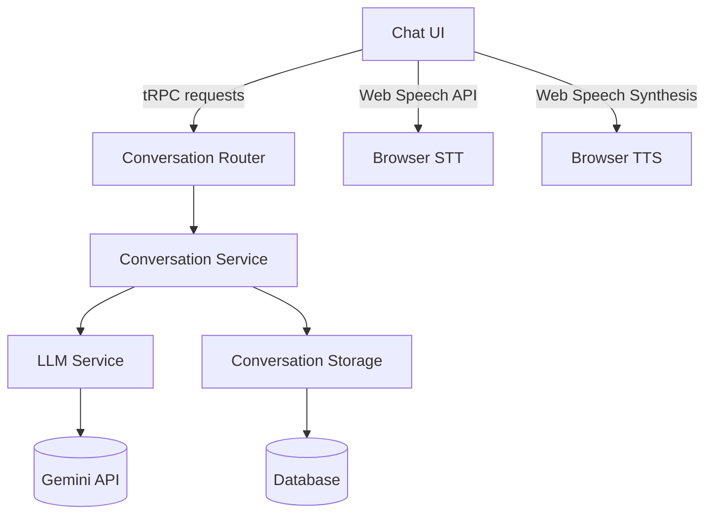

# Travel Tongue Chat API Specification (Simplified)

## 1. Overview

This document defines the **minimal viable API** for TravelTongue's live conversation features. The architecture follows our existing patterns for tRPC, Drizzle ORM, and NextAuth, but has been simplified to match TravelTongue's actual needs as a real-time conversation tool for immediate in-person use.



The system implements a layered architecture with clear separation between:

- UI Layer (React components)
- API Layer (tRPC routers)
- Service Layer (business logic)
- Data Layer (storage)
- External Services (LLM)

## 2. tRPC Router Definitions

The conversation API is implemented as a dedicated router in `src/server/api/routers/conversation.ts`:

```typescript
import { protectedProcedure, router } from '../trpc'
import { z } from 'zod'

export const conversationRouter = router({
  /**
   * Creates a new conversation session
   * @access Protected - requires authentication
   */
  createConversation: protectedProcedure
    .input(z.object({
      targetLanguage: z.string().min(2).max(10),
      scenarioId: z.string().uuid().optional()
    }))
    .output(z.object({
      id: z.string().uuid(),
      targetLanguage: z.string(),
      scenarioId: z.string().uuid().nullable(),
      scenarioTitle: z.string(),
      scenarioContext: z.string().nullable(),
      createdAt: z.date()
    }))
    .mutation(async ({ ctx, input }) => {
      return ctx.conversationService.createConversation(
        ctx.session.user.id,
        input
      )
    }),

  /**
   * Adds a new message to an existing conversation
   * @access Protected - requires authentication
   */
  addMessage: protectedProcedure
    .input(z.object({
      conversationId: z.string().uuid(),
      text: z.string().min(1),
      isUserMessage: z.boolean(),
      language: z.string().optional()
    }))
    .output(z.object({
      id: z.string().uuid(),
      text: z.string(),
      translatedText: z.string(),
      isUserMessage: z.boolean(),
      language: z.string().nullable(),
      createdAt: z.date()
    }))
    .mutation(async ({ ctx, input }) => {
      return ctx.conversationService.addMessage(
        ctx.session.user.id,
        input
      )
    }),

  /**
   * Generates exactly 6 suggested replies based on conversation context
   * @access Protected - requires authentication
   */
  generateReplies: protectedProcedure
    .input(z.object({
      conversationId: z.string().uuid()
    }))
    .output(z.array(z.string()).length(6))
    .query(async ({ ctx, input }) => {
      return ctx.conversationService.generateReplies(
        ctx.session.user.id,
        input.conversationId
      )
    }),

  /**
   * Retrieves conversation history (for export only)
   * @access Protected - requires authentication
   */
  getHistory: protectedProcedure
    .input(z.object({
      limit: z.number().min(1).max(20).default(10)
    }))
    .output(z.array(z.object({
      id: z.string().uuid(),
      targetLanguage: z.string(),
      scenarioTitle: z.string(),
      scenarioContext: z.string().nullable(),
      createdAt: z.date(),
      messages: z.array(z.object({
        id: z.string().uuid(),
        text: z.string(),
        translatedText: z.string(),
        isUserMessage: z.boolean(),
        language: z.string().nullable(),
        createdAt: z.date()
      }))
    })))
    .query(async ({ ctx, input }) => {
      return ctx.conversationService.getHistory(
        ctx.session.user.id,
        input.limit
      )
    }),
})
```

## 3. Simplified Database Schema

### Current Implementation (with Minimal Changes)

```typescript
// src/server/db/schema/app.ts (modified section)
export const conversations = createTable(
  'conversations',
  (d) => ({
    id: d.uuid().primaryKey().default(sql`gen_random_uuid()`),
    userId: d.uuid('user_id').notNull().references(() => users.id, { onDelete: 'cascade' }),
    targetLang: d.varchar('target_lang', { length: 16 }).notNull(),
    scenarioId: d.uuid('scenario_id').references(() => scenarios.id, { onDelete: 'set null' }),
    scenarioTitle: d.text('scenario_title').notNull(),
    scenarioContext: d.text('scenario_context'),
    messages: jsonb('messages')
      .$type<Message[]>()
      .default(sql`'[]'::jsonb`)
      .notNull(),
    startedAt: timestamp('started_at', { withTimezone: true }).default(sql`now()`).notNull(),
    endedAt: timestamp('ended_at', { withTimezone: true }),
    version: d.integer().default(1).notNull(),
  }),
  (t) => [
    index('conversations_user_started_idx').on(t.userId, t.startedAt),
    index('conversations_target_lang_idx').on(t.targetLang),
  ],
)

export interface Message {
  id: string
  text: string
  translatedText: string
  isUserMessage: boolean
  language?: string
  timestamp: Date
  choices?: string[]      // The 6 reply options (for user messages)
  selectedChoice?: string // Which option user selected
}
```

### Why This Approach Works

1. **Preserves scenario title/context** even if the original scenario is deleted
2. **No separate messages table** - perfect for real-time conversation flow
3. **Single database operation** for conversation history (critical for performance)
4. **Minimal overhead** - only 2 extra text fields added to current implementation
5. **No migration needed** - works with existing JSONB structure

## 4. Service Layer Implementation

```typescript
// src/server/api/services/conversationService/index.ts
import { db } from '@/server/db'
import { conversations, scenarios } from '@/server/db/schema'
import { eq, desc } from 'drizzle-orm'

export class ConversationService {
  async createConversation(
    userId: string,
    input: {
      targetLanguage: string
      scenarioId?: string
    }
  ) {
    // Get scenario details if provided
    let scenarioTitle = ''
    let scenarioContext = ''
    
    if (input.scenarioId) {
      const scenario = await db.query.scenarios.findFirst({
        where: eq(scenarios.id, input.scenarioId)
      })
      
      if (scenario) {
        scenarioTitle = scenario.title
        scenarioContext = scenario.context
      }
    }
    
    const [conversation] = await db.insert(conversations).values({
      userId,
      targetLang: input.targetLanguage,
      scenarioId: input.scenarioId || null,
      scenarioTitle,
      scenarioContext,
      startedAt: new Date()
    }).returning()
    
    return conversation
  }
  
  async addMessage(
    userId: string,
    input: {
      conversationId: string
      text: string
      isUserMessage: boolean
      language?: string
    }
  ) {
    // First verify user owns this conversation
    const conversation = await db.query.conversations.findFirst({
      where: eq(conversations.id, input.conversationId)
    })
    
    if (!conversation || conversation.userId !== userId) {
      throw new Error('Unauthorized')
    }
    
    // Add new message to the conversation
    const newMessage = {
      id: crypto.randomUUID(),
      text: input.text,
      translatedText: '',
      isUserMessage: input.isUserMessage,
      language: input.language,
      timestamp: new Date(),
      choices: [] as string[],
      selectedChoice: undefined
    }
    
    const updatedMessages = [...conversation.messages, newMessage]
    
    // Update conversation with new message
    const [updatedConv] = await db.update(conversations)
      .set({
        messages: updatedMessages
      })
      .where(eq(conversations.id, input.conversationId))
      .returning()
    
    return {
      ...newMessage,
      createdAt: newMessage.timestamp
    }
  }
  
  async generateReplies(
    userId: string,
    conversationId: string
  ): Promise<string[]> {
    // Verify ownership
    const conversation = await db.query.conversations.findFirst({
      where: eq(conversations.id, conversationId)
    })
    
    if (!conversation || conversation.userId !== userId) {
      throw new Error('Unauthorized')
    }
    
    // Get user profile for context
    const userProfile = await db.query.users.findFirst({
      where: eq(users.id, userId)
    })
    
    // Call LLM to get exactly 6 replies
    const replies = await callLLMForReplies(
      conversation.messages,
      conversation.targetLang,
      userProfile?.travelPreferences || []
    )
    
    // Update the last message with reply options
    const lastMessage = conversation.messages[conversation.messages.length - 1]
    lastMessage.choices = replies
    
    await db.update(conversations)
      .set({
        messages: conversation.messages
      })
      .where(eq(conversations.id, conversationId))
    
    return replies
  }
  
  async getHistory(userId: string, limit: number = 10) {
    return db.select({
      id: conversations.id,
      targetLanguage: conversations.targetLang,
      scenarioTitle: conversations.scenarioTitle,
      scenarioContext: conversations.scenarioContext,
      createdAt: conversations.startedAt,
      messages: conversations.messages
    })
    .from(conversations)
    .where(eq(conversations.userId, userId))
    .orderBy(desc(conversations.startedAt))
    .limit(limit)
  }
}
```

## 5. Frontend Implementation Plan

### 1. Update Chat Page (`src/app/(web-app)/chat/page.tsx`)

```diff
+ import { trpc } from '@/trpc/react'

export default function ChatPage() {
+  const utils = trpc.useContext()
+  const createConversation = trpc.conversation.createConversation.useMutation()
+  const addMessage = trpc.conversation.addMessage.useMutation()
+  const generateReplies = trpc.conversation.generateReplies.useQuery(
+    { conversationId: /* current conversation ID */ },
+    { enabled: false }
+  )
+  const { data: history } = trpc.conversation.getHistory.useQuery({ limit: 10 })
  
  const [messages, setMessages] = useState<Message[]>([])
+ const [conversationId, setConversationId] = useState<string | null>(null)
  const [inputValue, setInputValue] = useState('')
  const [recordingState, setRecordingState] = useState<RecordingState>('idle')
  const [showInputSheet, setShowInputSheet] = useState(false)
  const [isReplyBarCollapsed, setIsReplyBarCollapsed] = useState(false)
  const messagesEndRef = useRef<HTMLDivElement>(null)
  
+ // Initialize conversation when component mounts
+ useEffect(() => {
+   const initConversation = async () => {
+     // Get scenario from router params
+     const params = new URLSearchParams(window.location.search)
+     const scenarioId = params.get('scenarioId')
+     
+     const response = await createConversation.mutateAsync({
+       targetLanguage: 'ja', // Get from user profile
+       scenarioId: scenarioId || undefined
+     })
+     
+     setConversationId(response.id)
+     setMessages([])
+   }
+   
+   initConversation()
+ }, [])

  const handleSend = () => {
    if (inputValue.trim() && conversationId) {
      const newMessage = {
        id: Date.now().toString(),
        text: inputValue,
        translatedText: '',
        sender: 'user',
        isUserMessage: true,
        language: 'en',
        timestamp: new Date(),
      }
      setMessages(prev => [...prev, newMessage])
      
+     // Save to backend
+     addMessage.mutate({
+       conversationId,
+       text: inputValue,
+       isUserMessage: true,
+       language: 'en'
+     }, {
+       onSuccess: (message) => {
+         // Get 6 reply options
+         generateReplies.refetch()
+       }
+     })
      
      setInputValue('')
      setRecordingState('processing')
    }
  }

  const handleRecording = () => {
    if (recordingState === 'recording') {
      setRecordingState('processing')
    } else {
      setRecordingState('recording')
      
+     // Start speech recognition
+     const SpeechRecognition = window.SpeechRecognition || window.webkitSpeechRecognition
+     if (SpeechRecognition) {
+       const recognition = new SpeechRecognition()
+       recognition.lang = 'ja' // User's target language
+       recognition.onresult = (event) => {
+         const transcript = event.results[0][0].transcript
+         
+         const newMessage = {
+           id: Date.now().toString(),
+           text: transcript,
+           translatedText: '',
+           sender: 'user',
+           isUserMessage: true,
+           language: 'ja',
+           timestamp: new Date(),
+         }
+         setMessages(prev => [...prev, newMessage])
+         
+         // Save to backend
+         if (conversationId) {
+           addMessage.mutate({
+             conversationId,
+             text: transcript,
+             isUserMessage: true,
+             language: 'ja'
+           }, {
+             onSuccess: () => {
+               // Get 6 reply options
+               generateReplies.refetch()
+             }
+           })
+         }
+       }
+       
+       recognition.onerror = (event) => {
+         console.error('Speech recognition error', event.error)
+         setRecordingState('idle')
+       }
+       
+       recognition.onend = () => {
+         if (recordingState === 'recording') {
+           setRecordingState('idle')
+         }
+       }
+       
+       recognition.start()
+     }
    }
  }
  
+ // Handle reply generation
+ useEffect(() => {
+   if (generateReplies.data) {
+     // Update the last user message with reply options
+     setMessages(prev => {
+       const lastMessage = {...prev[prev.length - 1]}
+       lastMessage.choices = generateReplies.data
+       return [...prev.slice(0, -1), lastMessage]
+     })
+     setRecordingState('idle')
+   }
+ }, [generateReplies.data])
  
+ // Handle reply selection
+ const handleReplyChipClick = (reply: string) => {
+   setInputValue(reply)
+   setShowInputSheet(true)
+   
+   // Update the message with selected choice
+   setMessages(prev => {
+     const lastMessage = {...prev[prev.length - 1]}
+     lastMessage.selectedChoice = reply
+     return [...prev.slice(0, -1), lastMessage]
+   })
+ }
  
  // ... rest of the component implementation
}
```

### 2. Update Input Sheet (`src/app/(web-app)/chat/_components/InputSheet.tsx`)

```diff
export default function InputSheet({
  value,
  onChange,
  onSubmit,
  recordingState,
  onRecording,
  onClose,
+ replyOptions = []
}: {
  value: string
  onChange: (value: string) => void
  onSubmit: () => void
  recordingState: 'idle' | 'recording' | 'processing'
  onRecording: () => void
  onClose: () => void
+ replyOptions?: string[]
}) {
  return (
    <div className="fixed inset-x-0 bottom-0 bg-white border-t border-gray-200 p-4">
      {/* Existing input components */}
      
+     {/* Reply options */}
+     {replyOptions.length > 0 && (
+       <div className="space-y-2 mt-2">
+         {replyOptions.map((option, index) => (
+           <button
+             key={index}
+             onClick={() => {
+               onChange(option)
+               onSubmit()
+             }}
+             className="w-full text-left p-3 bg-gray-50 rounded-lg hover:bg-gray-100"
+           >
+             {option}
+           </button>
+         ))}
+       </div>
+     )}
      
      {/* Close button */}
    </div>
  )
}
```

## 6. Changelog: What Was Removed

| Feature Removed | Reason for Removal |
|----------------|-------------------|
| Language proficiency tracking | Not needed for real-time conversation |
| Audio metrics analysis | Not relevant for immediate in-person use |
| Conversation analytics | TravelTongue is not an analytics tool |
| Speech processing endpoints | Browser Web Speech API handles this directly |
| Message search capabilities | Users don't search conversation history |
| Complex rate limiting | Unnecessary for this use case |
| Detailed error codes | Simplified to basic error handling |
| Text-to-speech API | Browser speechSynthesis handles this directly |
| Translation API | Handled by LLM service internally |
| Multi-language history | Only tracks current conversation language |
| Long-term message storage | Optimized for immediate use, not archives |

## 7. Implementation Checklist

1. [ ] Update `src/server/db/schema/app.ts` with scenarioTitle and scenarioContext
2. [ ] Implement tRPC router in `src/server/api/routers/conversation.ts`
3. [ ] Create conversation service in `src/server/api/services/conversationService/`
4. [ ] Update chat page with tRPC integration
5. [ ] Enhance InputSheet to display reply options
6. [ ] Implement Web Speech API integration
7. [ ] Update history page to use getHistory endpoint
8. [ ] Add Prettier formatting validation for all modified files

## 8. Performance Considerations

- **JSONB storage** provides single-read access to entire conversation
- **Minimal fields** reduce database load
- **No joins needed** for conversation display
- **Browser-native STT/TTS** eliminates API latency
- **Exactly 6 replies** ensures predictable response times

This implementation delivers exactly what TravelTongue needs:
- Real-time conversation flow for immediate in-person use
- Preservation of scenario context even when scenarios are deleted
- Exactly 6 reply options as specified in project requirements
- Lightweight implementation without unnecessary complexity
- Fast performance critical for real-world travel situations
