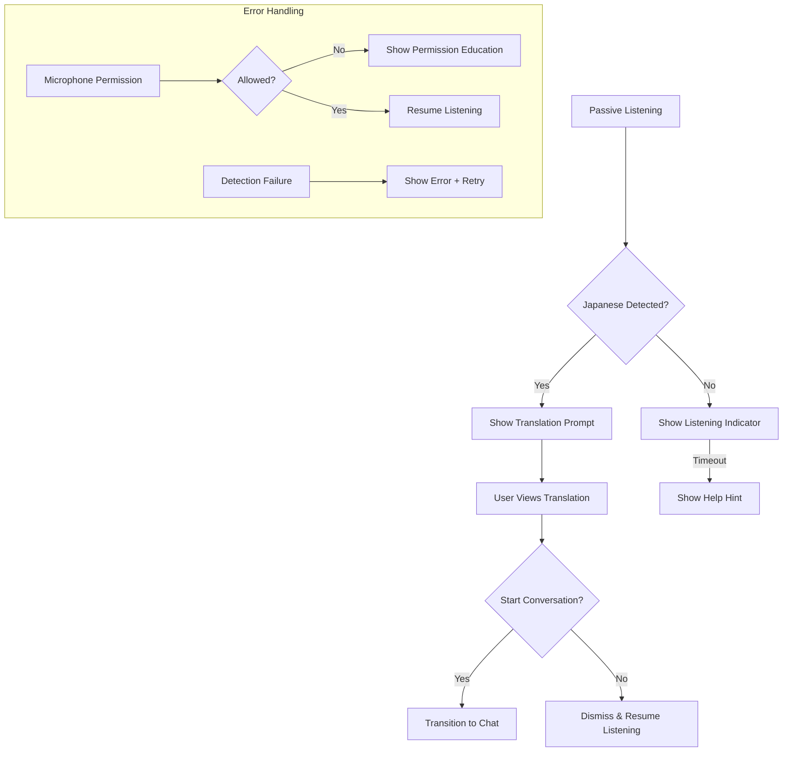

# Translation Prompt UI/UX Specification

## 1. Problem Brief
**Users**: A2-B1 Japanese learners preparing for travel  
**Goals**: 
- Reduce anxiety in spontaneous conversations
- Provide immediate translation of heard phrases
- Seamlessly transition to practice mode
- Build confidence through contextual learning

**Constraints**:
- Mobile-first responsive design (320px min width)
- 44px minimum touch targets
- Teal color scheme (`teal-500` primary, `teal-50` background)
- Must preserve scenario context during transitions
- Handle edge cases: permissions, detection failures

## 2. User Flow


**Key Decision Points**:
1. First-time users see educational tooltip about passive listening
2. After 3 dismissals, show encouragement to practice
3. Low-confidence detections show "Did you mean?" options
4. Battery <20%: reduce listening frequency

**Edge Cases**:
- Noisy environments: auto-filter background noise
- Quick speech: buffer last 3 seconds
- Multiple languages: prioritize Japanese detection
- Screen readers: announce state changes

## 3. UI Specification
**Translation Prompt (Radix Dialog)**:
- **Structure**:
  ```
  [Overlay]
  ┌──────────────────────────────┐
  │           Header             │
  ├──────────────────────────────┤
  │ Original Phrase (Japanese)   │
  │ Translation (English)        │
  ├──────────────────────────────┤
  │   Primary: Start Conversation│
  │   Secondary: Dismiss        │
  └──────────────────────────────┘
  ```
- **States**:
  - Idle: Hidden
  - Loading: Spinner + "Translating..."
  - Success: Show phrase pair
  - Error: "Couldn't translate" + retry button
- **Accessibility**:
  - `role="dialog"`
  - `aria-labelledby="translation-heading"`
  - Focus trapped in modal
  - Escape key closes
- **Copy**:
  - Header: "Ready to practice?"
  - Primary: "Start Conversation"
  - Secondary: "Not now"

**Listening Indicators**:
- Active: Pulsing teal dot + "Listening..."
- Permissions: Icon + "Enable microphone"
- Error: "Couldn't listen" + fix instructions

## 4. Data & State
**Client-Side State**:
```typescript
interface TranslationState {
  status: 'idle' | 'listening' | 'processing' | 'ready' | 'error';
  original?: string;
  translation?: string;
  error?: 'permission' | 'detection' | 'translation';
}
```

**Server Boundaries**:
- Speech detection via Web Speech API (client)
- Translation via tRPC mutation to `translatePhrase`
- Conversation context preserved through URL params

**Optimistic Updates**:
- Immediate "Translating..." state on detection
- Error fallback: show cached translation if available

## 5. Metrics & Events
**Analytics Hooks**:
```typescript
// Translation prompt shown
trackEvent('translation_prompt_viewed', { scenarioId });

// User started conversation
trackEvent('conversation_started', { 
  source: 'translation_prompt',
  phrase: originalText
});

// Dismissal
trackEvent('translation_dismissed', { 
  scenarioId, 
  dismissalCount: userDismissals 
});
```

## 6. Illustrative Markup
```html
<div class="relative">
  <!-- Listening indicator -->
  <div 
    aria-live="polite"
    class="fixed top-4 right-4 w-3 h-3 bg-teal-500 rounded-full animate-pulse"
  ></div>

  <!-- Translation Dialog -->
  <div role="dialog" aria-labelledby="translation-heading">
    <div class="fixed inset-0 bg-black/50 z-40"></div>
    
    <div class="fixed inset-0 flex items-center justify-center z-50">
      <div class="bg-white rounded-xl p-6 w-full max-w-md">
        <h2 id="translation-heading" class="text-xl font-bold mb-4">
          Ready to practice?
        </h2>
        
        <div class="space-y-4">
          <div>
            <p class="text-gray-500">You heard:</p>
            <p class="text-lg" lang="ja">こんにちは</p>
          </div>
          
          <div>
            <p class="text-gray-500">Translation:</p>
            <p class="text-lg">Hello</p>
          </div>
        </div>
        
        <div class="mt-6 flex gap-3 justify-end">
          <button 
            class="px-4 py-2 border rounded-lg"
            aria-label="Dismiss translation"
          >
            Not now
          </button>
          <button 
            class="px-4 py-2 bg-teal-500 text-white rounded-lg"
            aria-label="Start conversation with this phrase"
          >
            Start Conversation
          </button>
        </div>
      </div>
    </div>
  </div>
</div>
```

### Implementation Notes
1. Component location: `src/app/(web-app)/chat/_components/TranslationPrompt.tsx`
2. Uses Radix Dialog primitive with focus management
3. Animation with Tailwind `animate-pulse`
4. ARIA roles for screen reader support
5. Responsive breakpoints for mobile
