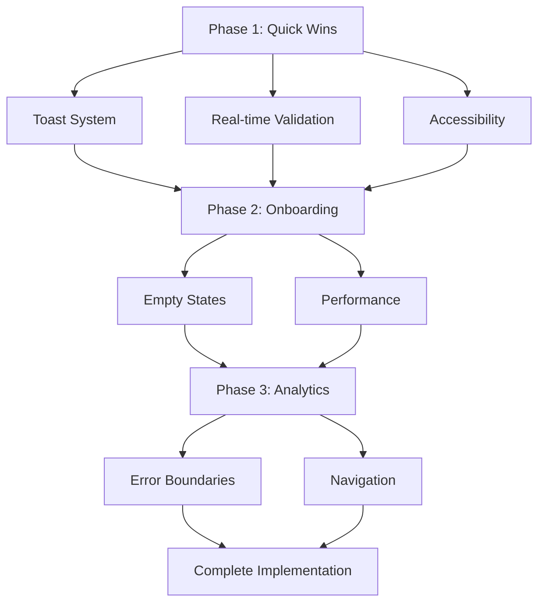

# Travel Tongue App - UX/UI Implementation Roadmap

## Executive Summary

This roadmap outlines the phased implementation of UX/UI improvements for the Travel Tongue language learning application. Based on current assessment, the app has a solid foundation with Next.js 15, tRPC, Drizzle ORM, and React Hook Form, but requires significant UX enhancements to improve user engagement and conversion rates.

## Current State Assessment

**Strengths:**
- Modern tech stack (Next.js 15, tRPC, Drizzle ORM)
- Existing multi-step onboarding flow
- Type-safe architecture with Zod validation
- Mobile-first responsive design
- Basic accessibility features implemented

**Improvement Opportunities:**
- Progressive profiling in onboarding
- Real-time form validation
- Action feedback mechanisms
- Accessibility compliance
- Performance optimizations
- Analytics and tracking
- Error handling and empty states

## Phase 1: Quick Wins (1-2 Weeks)

### 1.1 Toast Notifications System
**Priority:** High | **Complexity:** Low | **Estimate:** 2 days
- Install and configure `sonner` package
- Create toast utility service
- Implement success/error/loading states for key actions
- Add tRPC integration hooks

**Files to Modify:**
- [`package.json`](package.json:1) - Add sonner dependency
- [`src/utils/toast.ts`](src/utils/toast.ts:1) - New toast utility
- [`src/trpc/react.tsx`](src/trpc/react.ts:1) - Add tRPC error handling

### 1.2 Real-time Form Validation
**Priority:** High | **Complexity:** Low | **Estimate:** 3 days
- Enhance React Hook Form with Zod schemas
- Add inline validation for all forms
- Implement debounced validation for text inputs
- Improve error message display

**Files to Modify:**
- [`src/app/onboarding/_hooks/useOnboardingForm.tsx`](src/app/onboarding/_hooks/useOnboardingForm.tsx:1)
- [`src/app/(web-app)/edit-profile/_schemas/profileUpdate.ts`](src/app/(web-app)/edit-profile/_schemas/profileUpdate.ts:1)
- All form components

### 1.3 Accessibility Improvements
**Priority:** High | **Complexity:** Medium | **Estimate:** 4 days
- WCAG 2.1 AA compliance audit
- Enhance focus states and keyboard navigation
- Improve screen reader support
- Add ARIA labels and roles

**Files to Modify:**
- All component files with interactive elements
- [`src/styles/globals.css`](src/styles/globals.css:1) - Focus styles
- [`src/components/Button/index.tsx`](src/components/Button/index.tsx:1)
- [`src/components/TextInput/index.tsx`](src/components/TextInput/index.tsx:1)

## Phase 2: Core Improvements (2-4 Weeks)

### 2.1 Enhanced Onboarding Experience
**Priority:** High | **Complexity:** Medium | **Estimate:** 1 week
- Add visual progress indicator
- Implement localStorage for partial progress
- Step-by-step validation
- Improved error recovery

**Files to Modify:**
- [`src/app/onboarding/_components/OnboardingForm.tsx`](src/app/onboarding/_components/OnboardingForm.tsx:1)
- [`src/app/onboarding/_stores/index.tsx`](src/app/onboarding/_stores/index.tsx:1)
- Add progress bar component

### 2.2 Empty States Design
**Priority:** Medium | **Complexity:** Low | **Estimate:** 3 days
- Design contextual empty state components
- Implement for phrases, scenarios, history
- Add call-to-action buttons
- Responsive empty state layouts

**Files to Create:**
- [`src/components/EmptyState/index.tsx`](src/components/EmptyState/index.tsx:1)
- [`src/app/(web-app)/home/page.tsx`](src/app/(web-app)/home/page.tsx:1) - Integrate
- [`src/app/(web-app)/history/page.tsx`](src/app/(web-app)/history/page.tsx:1) - Integrate

### 2.3 Performance Optimizations
**Priority:** Medium | **Complexity:** High | **Estimate:** 1 week
- Implement React Suspense for async components
- Add skeleton loading states
- Optimize tRPC query caching
- Code splitting for larger components

**Files to Modify:**
- All page components with async data
- [`src/trpc/react.tsx`](src/trpc/react.ts:1) - Cache configuration
- Create skeleton components

## Phase 3: Advanced Features (4-8 Weeks)

### 3.1 Analytics & Event Tracking
**Priority:** Medium | **Complexity:** Medium | **Estimate:** 2 weeks
- Implement tRPC middleware for event tracking
- Set up analytics service (PostHog/Amplitude)
- Define and track key metrics
- User behavior analysis

**Files to Create/Modify:**
- [`src/server/api/middleware/analytics.ts`](src/server/api/middleware/analytics.ts:1)
- [`src/utils/analytics.ts`](src/utils/analytics.ts:1)
- Event definitions

### 3.2 Error Boundaries & Recovery
**Priority:** High | **Complexity:** Medium | **Estimate:** 1 week
- Implement React Error Boundaries
- Graceful error handling
- User-friendly error messages
- Recovery mechanisms

**Files to Create:**
- [`src/components/ErrorBoundary/index.tsx`](src/components/ErrorBoundary/index.tsx:1)
- [`src/components/ErrorFallback/index.tsx`](src/components/ErrorFallback/index.tsx:1)

### 3.3 Advanced Navigation Patterns
**Priority:** Medium | **Complexity:** Medium | **Estimate:** 1 week
- Consistent back navigation
- Breadcrumb system
- Deep linking support
- Navigation state management

**Files to Modify:**
- [`src/app/(web-app)/_components/Navbar.tsx`](src/app/(web-app)/_components/Navbar.tsx:1)
- Navigation utilities

## Dependency Graph

## Resource Allocation

| Role | Phase 1 | Phase 2 | Phase 3 | Total Weeks |
|------|---------|---------|---------|-------------|
| Frontend Developer | 2 | 2 | 2 | 6 |
| UX Designer | 1 | 1 | 0.5 | 2.5 |
| QA Engineer | 0.5 | 1 | 1 | 2.5 |
| **Total** | **3.5** | **4** | **3.5** | **11** |

## Risk Mitigation Strategies

### Technical Risks
1. **Performance Impact**: Test optimizations with Lighthouse before/after
2. **Accessibility Regression**: Automated a11y testing with each PR
3. **Bundle Size Increase**: Monitor bundle size with webpack-bundle-analyzer

### Process Risks
1. **Scope Creep**: Strict prioritization based on impact metrics
2. **Integration Issues**: Comprehensive integration testing plan
3. **User Adoption**: Gradual rollout with feature flags

### Quality Risks
1. **Browser Compatibility**: Cross-browser testing matrix
2. **Mobile Responsiveness**: Device lab testing
3. **Accessibility**: Regular audits with axe-core

## Testing & QA Plan

### Unit Testing
- Component testing with Jest + Testing Library
- Form validation testing
- Utility function testing
- **Coverage Target**: 80%+

### Integration Testing
- User flow testing (onboarding, scenario creation)
- tRPC API integration tests
- Cross-component interaction tests

### User Acceptance Testing
- Beta testing group recruitment
- Usability testing sessions
- A/B testing for key flows

### Accessibility Testing
- Automated testing with axe-core
- Manual screen reader testing
- Keyboard navigation testing
- Color contrast validation

### Performance Testing
- Lighthouse performance scoring
- Core Web Vitals monitoring
- Load testing for critical paths

## Deployment Strategy

### Staging Environment
- Dedicated staging deployment
- Feature flag system for gradual rollout
- Performance monitoring setup
- User acceptance testing environment

### Production Deployment
- Canary releases for high-risk changes
- Blue-green deployment strategy
- Comprehensive rollback procedures
- Real-time monitoring and alerting

### Monitoring & Analytics
- Error tracking with Sentry
- Performance monitoring
- User behavior analytics
- Conversion rate tracking

## Success Metrics & KPIs

### Engagement Metrics
- **Onboarding Completion Rate**: Target 85%+
- **Daily Active Users**: Increase by 30%
- **Session Duration**: Increase by 25%
- **Feature Adoption**: Track new feature usage

### Performance Metrics
- **Lighthouse Score**: >90 for all categories
- **First Contentful Paint**: <1.5s
- **Time to Interactive**: <3.5s
- **Bundle Size**: <500KB initial load

### Quality Metrics
- **Error Rate**: <0.1% of sessions
- **Accessibility Score**: WCAG 2.1 AA compliant
- **User Satisfaction**: NPS >40
- **Retention Rate**: W